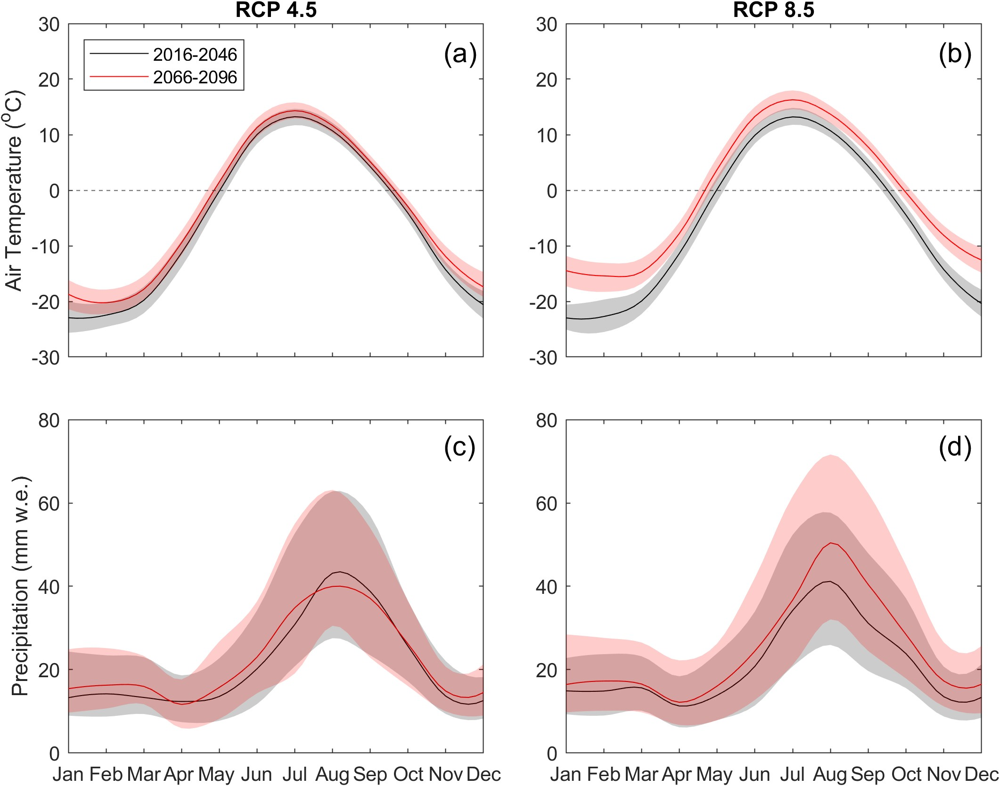
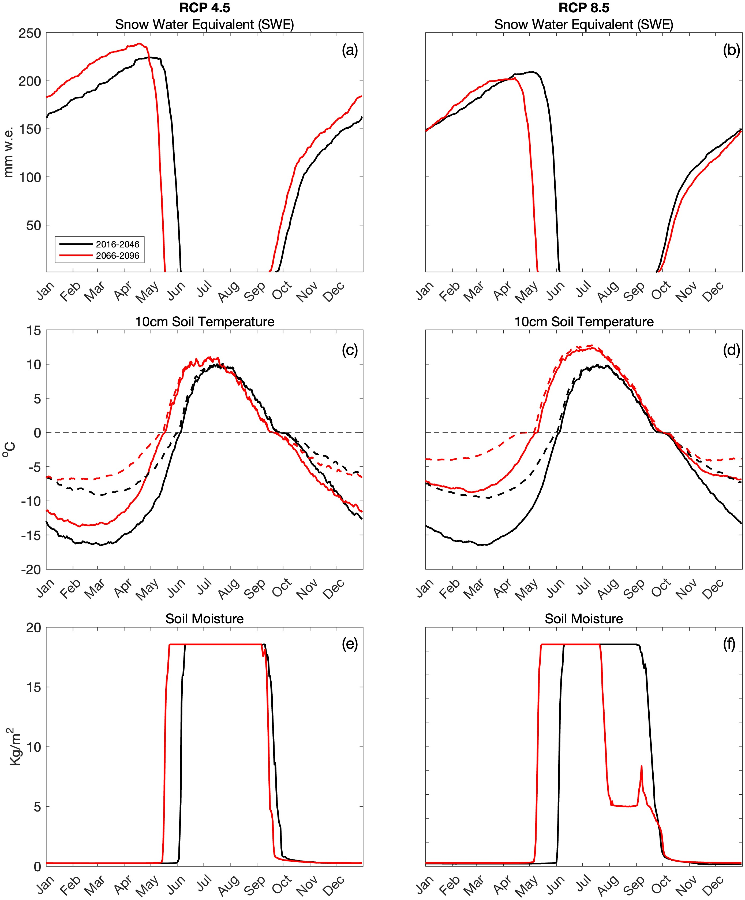
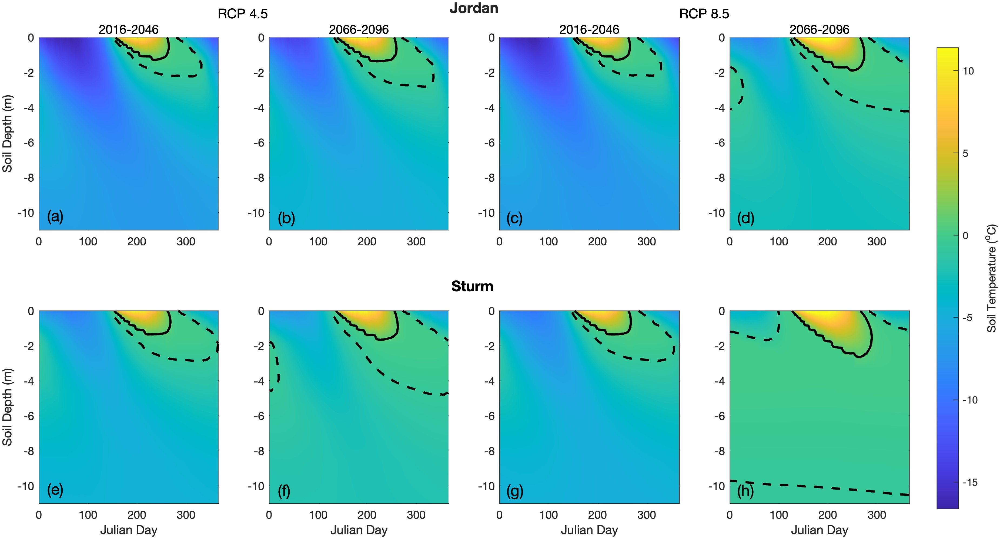
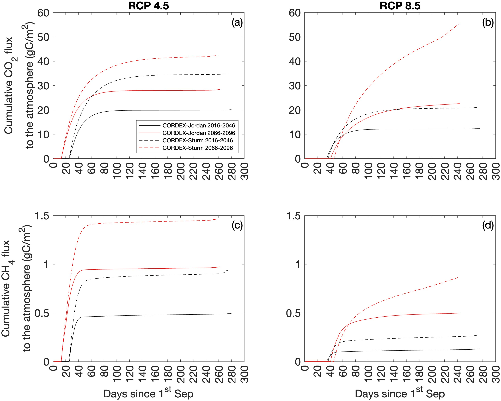
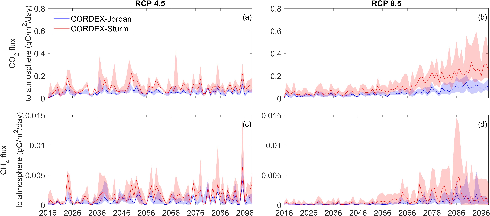

# Snow thermal conductivity controls future simulations of winter carbon emissions in shrub-tundra
## Abstract
The Arctic winter period is disproportionately vulnerable to climate warming and few studies focus on cold season processes. The parameterisation of processes controlling heterotrophic respiration have been poorly represented by Land Surface Models (LSMs) to date, resulting in uncertainty in winter carbon emissions simulations for Arctic regions. An ensemble of NA-CORDEX (North American Coordinated Regional Downscaling Experiment) GCM-RCM simulations to 2100AD indicate that increases in future air temperature may contribute to a shift in precipitation from being snow- to rain-dominated in the shoulder seasons at Trail Valley Creek (TVC), a boreal tundra site. Such shifts in precipitation influences the timing of snow onset, snow duration, soil temperatures and soil respiration rates during winter. Cumulative winter CO2 and CH4 fluxes, simulated using a point-model version of CLM 5.0, are forecast to increase in the future under RCP 4.5 and 8.5. Increasing air temperatures resulting in a shorter snow season under RCP 8.5 reduces magnitude of cumulative winter emissions compared with RCP 4.5 and highlights the importance of the early season period in the accumulation of winter emissions from shrub-tundra. The parameterisation of snow effective conductivity (Keff) within LSMs is crucial for simulating soil temperatures during the winter due to the insulating effect of seasonal snow. Implementing a Keff parameterisation which is more representative of Arctic snowpacks triples CLM5.0 simulated winter CO2 and doubles simulated CH4 flux compared to the default parameterisation, under RCP 8.5. The influence of snow representation within CLM5.0 on future simulated CO2¬ is at least as significant, if not more so, than the variability introduced by applying a range of CORDEX meteorologies to 2100AD. Furthermore, CLM5.0 simulations show an increased duration of the early winter zero-curtain by up to a month suggesting that recent increases in both zero-curtain and winter CO2 emissions are set to continue to 2100AD.

# Repository guide
The gitrepo should contain 3 folders. Matlab is used to create all the figures and the data needed to produce the figures is available at:
- CLM_TVC
- CORDEX_TVC
- Images

## CORDEX_TVC
This folder contains matlab scripts for figures 1 & 2:

<figure>
  
  <figcaption>Figure 1</figcaption>
</figure>

<figure>
  
  <figcaption>Figure 2</figcaption>
</figure>

## CLM_TVC
This folder contains matlab scripts for figures 3-6:

<figure>
  
  <figcaption>Figure 3</figcaption>
</figure>

<figure>
  
  <figcaption>Figure 4</figcaption>
</figure>

<figure>
  
  <figcaption>Figure 5</figcaption>
</figure>

<figure>
  
  <figcaption>Figure 6</figcaption>
</figure>

## Images
This folder contains image files for paper figures.

