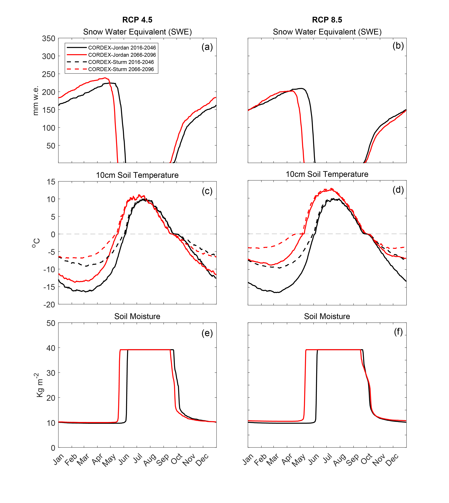

# Snow thermal conductivity controls future simulations of winter carbon emissions in shrub-tundra
## Abstract
The Arctic winter period is disproportionately vulnerable to climate warming and few studies focus on cold season processes. The parameterisation of processes controlling heterotrophic respiration have been poorly represented by Land Surface Models (LSMs) to date, resulting in uncertainty in winter carbon emissions simulations for Arctic regions. An ensemble of NA-CORDEX (North American Coordinated Regional Downscaling Experiment) GCM-RCM simulations to 2100AD indicate that increases in future air temperature may contribute to a shift in precipitation from being snow- to rain-dominated in the shoulder seasons at Trail Valley Creek (TVC), a boreal tundra site. Such shifts in precipitation influences the timing of snow onset, snow duration, soil temperatures and soil respiration rates during winter. Cumulative winter CO2 and CH4 fluxes, simulated using a point-model version of CLM 5.0, are forecast to increase in the future under RCP 4.5 and 8.5. Increasing air temperatures resulting in a shorter snow season under RCP 8.5 reduces magnitude of cumulative winter emissions compared with RCP 4.5 and highlights the importance of the early season period in the accumulation of winter emissions from shrub-tundra. The parameterisation of snow effective conductivity (Keff) within LSMs is crucial for simulating soil temperatures during the winter due to the insulating effect of seasonal snow. Implementing a Keff parameterisation which is more representative of Arctic snowpacks triples CLM5.0 simulated winter CO2 and doubles simulated CH4 flux compared to the default parameterisation, under RCP 8.5. The influence of snow representation within CLM5.0 on future simulated CO2¬ is at least as significant, if not more so, than the variability introduced by applying a range of CORDEX meteorologies to 2100AD. Furthermore, CLM5.0 simulations show an increased duration of the early winter zero-curtain by up to a month suggesting that recent increases in both zero-curtain and winter CO2 emissions are set to continue to 2100AD.

# Plain Language summary and aims
The Arctic winter is highly vumnerable to climate change, but few studies focus on this cold season. Land Surface Models (LSMs) are numerical representations of the physical environment, and current models do not represent certain Arctic processes well, particularly those governing soil carbon emissions. First we examine a dataset (n=33) of modelled future air temperature and precipitation (NA-CORDEX) for an Arctic site in NWT, Canada, a location which is changing rapidly due to climate warming. This dataset shows increasing winter air temperatures and a greater abundance of rain particularly in the early winter (Aug-Sep). The NA-CORDEX dataset provides our LSM of interest, the Community Land Model (CLM5.0), with the meteorological data needed to simulate snow, soil and carbon emissions at TVC from present day to 2100AD. CLM5.0 doesn't currently represent Arctic snow well, particularly the ability of snow to insulate the soil from very cold winter air temperatures. As such, this poor representation of the snow leads to inaccurate modelling of winter soil temperatures and subsequent winter soil carbon emissions. Here we quantify the infulence of the snow on the soil temperature when running simulations with CLM5.0 and present a way of improving this representation of snow.

# Data guide
All data needed to reproduce the figures is included in each respective folder as .mat files. Each .m script loads the respective needed to produce the figure. It should be noted that in order to finalise figures Adobe Illustrator was used to make very minor edits and as such the figures produced using these matlab scripts may not be identical to the figures in the paper.

# Repository guide
The gitrepo contains 3 folders. Matlab is used to create all the figures.
- CORDEX_TVC: produces figures 1 and 2 which show future projections of precipitation and air temperature at Trail Valley Creek, NWT using an ensemble of climate models (CORDEX).
- CLM_TVC: produces figures 3-6 which show CLM5.0 simulated snow water equivalent, 10cm soil temperature, soil moisture, soil temperature with depth, cumulative soil carbon emissions and winter future carbon emissions.
- Images: contains images of all figures

## CORDEX_TVC
This folder contains matlab scripts for figures 1 & 2

**Figure 1: Air temperature and precipitation**

**Figure 2: Precipitation frequency vs air temperature**

## CLM_TVC
This folder contains matlab scripts for figures 3-6

**Figure 3: Snow water equivalent, soil temperature and soil moisture**

**Figure 4: Soil temperature and zero-curtain duration**

**Figure 5: Cumulative CO2 and CH4 flux**

**Figure 6: Future winter CO2 and CH4 flux**

**Appendix A: Air temperature and precipitation by ensemble member**

**Appendix B: Aug-Dec zero curtain duration**

**Appendix C: CLM5.0 parameter combinations**

**Appendix D: Cumulative soil carbon outputs constrained by the snow-down period and irrespective of snow**

**Appendix E: Winter soil carbon as a function of the full range of chosen parameter space**

## Images
This folder contains image files for paper figures.

